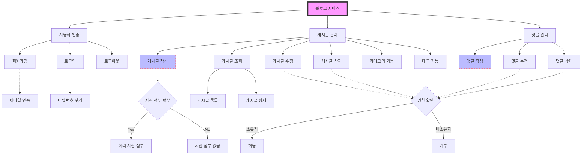
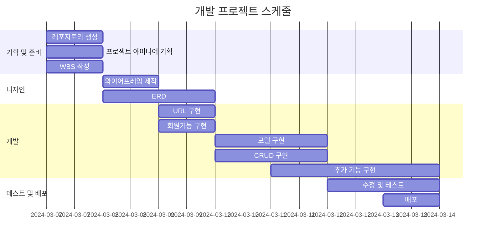

# 📸 Pholog

## 1. 목표와 기능

### 1.1 목표
- **Django 학습:** 실제로 서비스를 만들어보며 Django에 익숙해지기
- **DB 설계 및 구축 경험:** 데이터베이스 설계(ERD), 모델링
- **프로젝트 진행 경험** 

### 1.2 기능
- **회원기능**
    - 로그인 / 로그아웃
    - 회원가입
- **CRUD**
    - 게시글 작성/읽기/수정/삭제
    - 이미지 다중 첨부
- **카테고리**
    - 게시글마다 카테고리 지정 가능
- **태그**
    - 게시글 작성 시 여러개의 태그 추가 가능
    - 태그별로 게시글 검색 가능
- **댓글**
    - 타 게시글에 댓글 작성/수정/삭제

## 2. 개발 환경 및 배포 URL

### 2.1 개발 환경
- **사용 툴**
    - VSCode
- **사용 언어**
    - HTML, CSS, JS
    - Python
- **Web Framework**
    - Django 5.0.2
- **서비스 배포**
    - AWS Lightsail

### 2.2 배포 URL
http://15.164.3.24:8000/
```
테스트용 계정
ID: test
PW: test1234!
```

### 2.3 URL 구조 (모놀리식)
- **main**

| App  | URL | Views Function | HTML File Name  | Note |
|------|-----|----------------|-----------------|------|
| main | "/" | index          | main/index.html |메인 화면|

- **blog**

| App  | URL                         | Views Function  | HTML File Name                          | Note |
|------|-----------------------------|-----------------|-----------------------------------------|------|
| blog | "/"                         | post_list       | posts/post_list.html                    |사용자 게시글 목록 |
| blog | "all/"                      | all_post_list   | posts/all_post_list.html                |전체 게시글 목록   |
| blog | "create/"                   | post_create     | posts/post_form.html                    |게시글 작성       |
| blog | "<int:pk>/"                 | post_detail     | posts/post_detail.html                  |게시글 상세페이지  |
| blog | "<int:pk>/update/"          | post_update     | posts/post_form.html                    |게시글 수정       |
| blog | "<int:pk>/delete/"          | post_delete     | posts/post_confirm_delete.html          |게시글 삭제여부 확인|
| blog | "<int:pk>/comment/"         | comment_create  | posts/post_detail.html                  |댓글 작성         |
| blog | "comment/<int:pk>/update/"  | comment_update  | comments/comment_form.html              |댓글 수정         |
| blog | "comment/<int:pk>/delete/"  | comment_delete  | comments/comment_confirm_delete.html    |댓글 삭제여부 확인  |
| blog | "category/"                 | category_list   | categories/category_list.html           |카테고리 목록      |
| blog | "category/create/"          | category_create | categories/category_form.html           |카테고리 생성      |
| blog | "category/<int:pk>/update/" | category_update | categories/category_form.html           |카테고리 수정      |
| blog | "category/<int:pk>/delete/" | category_delete | categories/category_confirm_delete.html |카테고리 삭제여부 확인|
| blog | "tag/<str:tag_name>/"       | tag_list        | posts/tag_list.html                     |태그에 해당하는 게시글 목록|

- **accounts**

| App      | URL        | Views Function | HTML File Name        | Note |
|----------|------------|----------------|-----------------------|------|
| accounts | "signup/"  | signup         | accounts/form.html    |회원가입|
| accounts | "login/"   | login          | accounts/form.html    |로그인  |
| accounts | "logout/"  | logout         | base.html             |로그아웃(모달)|
| accounts | "profile/" | profile        | accounts/profile.html |프로필  |

## 3. 요구사항 명세와 기능 명세



## 4. 프로젝트 구조와 개발 일정

### 4.1 프로젝트 구조
```
📦Pholog
 ┣ 📂accounts
 ┃ ┣ 📂migrations
 ┃ ┣ 📂__pycache__
 ┃ ┣ 📜admin.py
 ┃ ┣ 📜apps.py
 ┃ ┣ 📜models.py
 ┃ ┣ 📜tests.py
 ┃ ┣ 📜urls.py
 ┃ ┣ 📜views.py
 ┃ ┗ 📜__init__.py
 ┣ 📂blog
 ┃ ┣ 📂migrations
 ┃ ┣ 📂__pycache__
 ┃ ┣ 📜admin.py
 ┃ ┣ 📜apps.py
 ┃ ┣ 📜forms.py
 ┃ ┣ 📜models.py
 ┃ ┣ 📜tests.py
 ┃ ┣ 📜urls.py
 ┃ ┣ 📜views.py
 ┃ ┗ 📜__init__.py
 ┣ 📂config
 ┃ ┣ 📂__pycache__
 ┃ ┣ 📜asgi.py
 ┃ ┣ 📜settings.py
 ┃ ┣ 📜urls.py
 ┃ ┣ 📜wsgi.py
 ┃ ┗ 📜__init__.py
 ┣ 📂main
 ┃ ┣ 📂migrations
 ┃ ┣ 📂__pycache__
 ┃ ┣ 📜admin.py
 ┃ ┣ 📜apps.py
 ┃ ┣ 📜models.py
 ┃ ┣ 📜tests.py
 ┃ ┣ 📜urls.py
 ┃ ┣ 📜views.py
 ┃ ┗ 📜__init__.py
 ┣ 📂media
 ┃ ┗ 📂blog
 ┣ 📂static
 ┃ ┗ 📜git_icon.png
 ┣ 📂templates
 ┃ ┣ 📂accounts
 ┃ ┃ ┣ 📜form.html
 ┃ ┃ ┗ 📜profile.html
 ┃ ┣ 📂categories
 ┃ ┃ ┣ 📜category_confirm_delete.html
 ┃ ┃ ┣ 📜category_form.html
 ┃ ┃ ┗ 📜category_list.html
 ┃ ┣ 📂comments
 ┃ ┃ ┣ 📜comment_confirm_delete.html
 ┃ ┃ ┗ 📜comment_form.html
 ┃ ┣ 📂main
 ┃ ┃ ┗ 📜index.html
 ┃ ┣ 📂posts
 ┃ ┃ ┣ 📜all_post_list.html
 ┃ ┃ ┣ 📜post_confirm_delete.html
 ┃ ┃ ┣ 📜post_detail.html
 ┃ ┃ ┣ 📜post_form.html
 ┃ ┃ ┣ 📜post_list.html
 ┃ ┃ ┗ 📜tag_list.html
 ┃ ┗ 📜base.html
 ┣ 📜.gitignore
 ┣ 📜db.sqlite3
 ┣ 📜manage.py
 ┣ 📜README.md
 ┗ 📜requirements.txt
```

### 4.2 개발 일정(WBS)
- 아래 일정표는 머메이드로 작성했습니다.



## 5. 와이어프레임 / UI / BM

### 5.1 와이어프레임

- Pigma로 제작하였습니다.
- [링크](https://www.figma.com/file/BsKyiIDvmN5hIa36lKpnsu/Pholog?type=design&node-id=3%3A7&mode=design&t=s3XkE9xQVq0STWCz-1)

### 5.2 화면 설계
|이름|이미지|이름|이미지|
|---|---|---|---|
|메인 페이지||회원가입/로그인 페이지||
|전체 게시글||내 게시글||
|게시글 상세페이지||게시글 작성||
|태그별 게시글||카테고리 관리||

## 6. 데이터베이스 모델링 (ERD)

- https://dbdiagram.io/ 을 통해 제작했습니다.

## 7. 메인 기능
- **CRUD**
    - User만 게시글 작성 가능
    - 게시글 읽기
    - 해당 게시글을 작성한 User만 수정, 삭제 가능

- **다수의 Image 첨부 가능**
    - ImageFormset(inlineformset)을 이용
    - 한 게시물에 최대 5개의 이미지 첨부 가능 (첨부 갯수 조정 가능)
    - 첨부한 이미지 삭제, 변경 가능

- **카테고리**
    - 각 User별로 카테고리 기능 사용 가능
    - 카테고리 수정, 삭제

- **댓글**
    - 게시글 아래에 댓글 작성 가능
    - 작성한 User만 수정, 삭제 가능

- **태그**
    - 게시글 작성 시 `#`을 기준으로 태그 추가 가능
    - 태그별로 게시글을 모아볼 수 있음

- **검색**
    - 제목, 내용에 해당 키워드가 포함된 게시글을 검색할 수 있음

- **All / User 분리**
    - **전체 포스팅/개인 포스팅** 으로 나눔 -> 커뮤니티/개인공간의 효과
    - 검색 역시 **전체/개인** 별로 가능하다.

## ⁉️ 8. 에러와 에러 해결
- **ImageFormSet(inlineformset)을 이용해 다중 이미지 첨부를 구현했다.**
    - 삭제/수정 기능이 정상적으로 동작하지 않았음.
        - ImageFormSet은 DELETE 속성을 지원하므로 업로드한 이미지 삭제가 가능하다.
        - 하지만 삭제한 이미지가 그대로 남아있거나, Form이 리셋되는 현상이 나타남.
        - 또한 기존에 첨부한 이미지를 변경하려고 하면 경로를 찾지 못함.
        - 경로 지정 문제라고 판단.
    - 이미지 저장 시 uuid를 이용해 중복방지, 보안성을 높였으나 에러 해결을 위해 제거.
    - uuid 제거 후 올바른 경로를 지정해도 해결 X
    - update view에 `try-except`구문을 추가, post_form 템플릿 수정 -> 해결
    - 정확한 원인 찾는중

- **태그 문자열 처리**
    - `#`을 기준으로 분리 -> 차례대로 리스트에 추가 -> DB에 반영을 계획했지만 에러
        - `tags`필드를 중복 작성해서 생긴 에러로 form 수정 후 해결
    - 게시글 수정 시 입력했던 태그들이 Queryset 형태로 나타남.
        - Postform의 `__init__`함수에서 쿼리셋 => 문자열로 변환 후 join

- **카테고리**
    - 아무것도 선택/생성하지 않았을 경우 -> 에러!
    - (1)자동으로 카테고리 생성해주기 (2)카테고리 폼 자체를 multiple로 설정
    - (2)로 결정. 대신 디자인을 multiple하지않게 변경.
        - form은 multiple한 form으로 구성, <select>유형을 single select형태로 지정.
        - 정답이 아님을 이용한 정답
    - 다른 유저가 생성한 카테고리가 보이는 에러
        - 마찬가지로 Postform의 `__init__`함수 수정.
        - 카테고리의 auther = user 인 케이스만 보여주도록 변경.

이미지 처리 부분에서 총 시간의 80%는 소비한것같다.

---

## ✏️ 8. 개발하며 느낀점
- 모델 설계 부분이 중요한 것 같다. 잘못된 설계때문에 자잘한 에러가 있었다. (1:N 관계 설정 등...)
- 데이터가 어떻게 오고가는지 제대로 알아야겠다.
- 웹 개발을 하려면 JS는 필수인듯하다.
- 시간이 오래 걸리더라도 초반에 길을 잘 잡아놔야한다... 계획과 구성, 구성 계획의 중요성.


## 9. 피드백
pass

## 10. Self-Code review
pass
